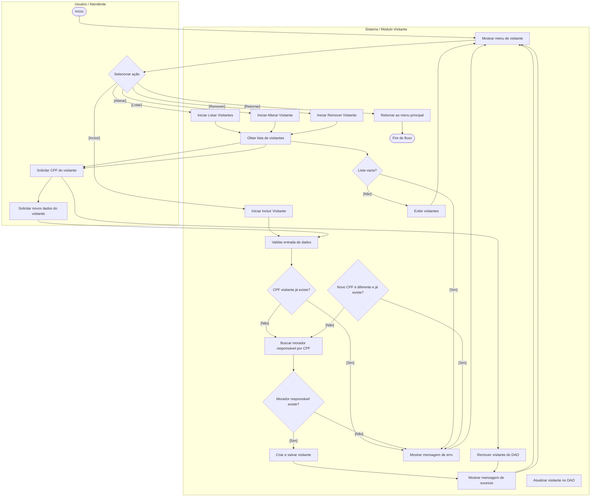

```mermaid
flowchart TB
    %% Definição das Raias de Papéis (Swimlanes)
    subgraph Ator_Usuario [Usuário / Atendente]
        start([Início])
        escolherAcao{Selecionar ação}
        selecionarVisitante[Solicitar CPF do visitante]
        pegarNovosDados[Solicitar novos dados do visitante]
    end

    subgraph Sistema [Sistema / Módulo Visitante]
        abrirMenu[Mostrar menu de visitante]
        incluir[Iniciar Incluir Visitante]
        listar[Iniciar Listar Visitantes]
        alterar[Iniciar Alterar Visitante]
        remover[Iniciar Remover Visitante]
        retornar[Retornar ao menu principal]
        
        inicioValidar[Validar entrada de dados]
        verificarCpfExistente{CPF visitante já existe?}
        buscarMorador[Buscar morador responsável por CPF]
        moradorExiste{Morador responsável existe?}
        criarVisitante[Criar e salvar visitante]
        mostrarSucesso[Mostrar mensagem de sucesso]
        mostrarErro[Mostrar mensagem de erro]
        listarDados[Obter lista de visitantes]
        listaVazia{Lista vazia?}
        mostrarLista[Exibir visitantes]
        verificarCpfAlteracao{Novo CPF é diferente e já existe?}
        atualizarVisitante[Atualizar visitante no DAO]
        excluirVisitante[Remover visitante do DAO]
        fim([Fim do fluxo])
    end

    %% Fluxo Principal e Decisões com Notação de Colchetes [Guardas]
    start --> abrirMenu --> escolherAcao
    
    escolherAcao -->|"[Incluir]"| incluir
    escolherAcao -->|"[Listar]"| listar
    escolherAcao -->|"[Alterar]"| alterar
    escolherAcao -->|"[Remover]"| remover
    escolherAcao -->|"[Retornar]"| retornar

    %% Fluxo Incluir
    incluir --> inicioValidar --> verificarCpfExistente
    verificarCpfExistente -->|"[Sim]"| mostrarErro
    verificarCpfExistente -->|"[Não]"| buscarMorador
    buscarMorador --> moradorExiste
    moradorExiste -->|"[Não]"| mostrarErro
    moradorExiste -->|"[Sim]"| criarVisitante --> mostrarSucesso --> abrirMenu

    %% Fluxo Listar
    listar --> listarDados --> listaVazia
    listaVazia -->|"[Sim]"| mostrarErro
    listaVazia -->|"[Não]"| mostrarLista --> abrirMenu

    %% Fluxo Alterar
    alterar --> listarDados --> selecionarVisitante --> pegarNovosDados --> inicioValidar
    verificarCpfAlteracao -->|"[Sim]"| mostrarErro
    verificarCpfAlteracao -->|"[Não]"| buscarMorador
    
    %% Fluxo Remover
    remover --> listarDados --> selecionarVisitante --> excluirVisitante --> mostrarSucesso --> abrirMenu
    retornar --> fim

    mostrarErro --> abrirMenu
```
