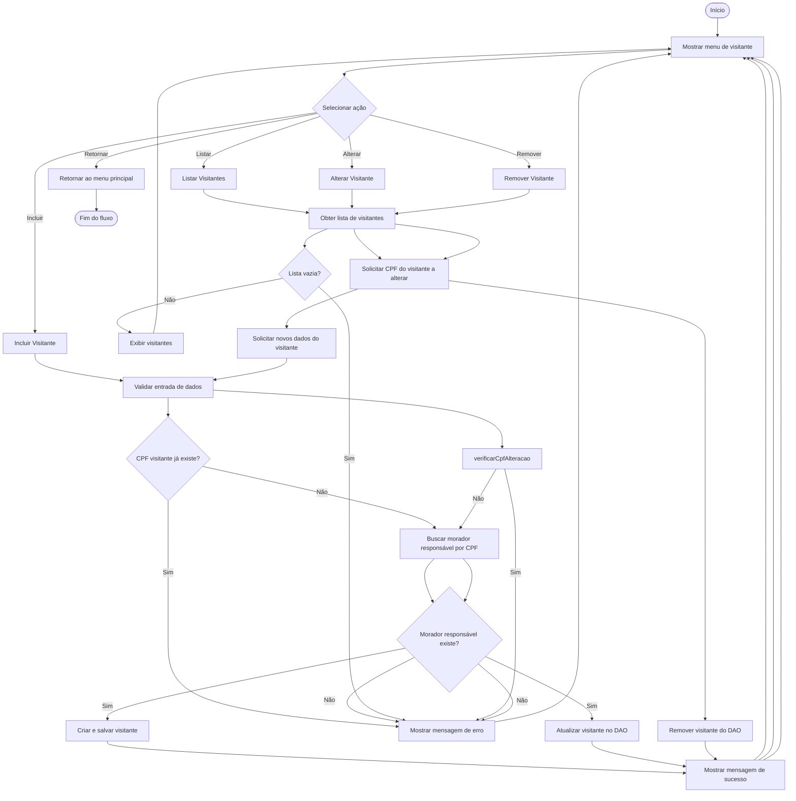

```mermaid
flowchart TB
    start([Início])
    abrirMenu[Mostrar menu de visitante]
    escolherAcao{Selecionar ação}
    incluir[Incluir Visitante]
    listar[Listar Visitantes]
    alterar[Alterar Visitante]
    remover[Remover Visitante]
    retornar[Retornar ao menu principal]

    inicioValidar[Validar entrada de dados]
    verificarCpfExistente{CPF visitante já existe?}
    buscarMorador[Buscar morador responsável por CPF]
    moradorExiste{Morador responsável existe?}
    criarVisitante[Criar e salvar visitante]
    mostrarSucesso[Mostrar mensagem de sucesso]
    mostrarErro[Mostrar mensagem de erro]
    listarDados[Obter lista de visitantes]
    listaVazia{Lista vazia?}
    mostrarLista[Exibir visitantes]
    selecionarVisitante[Solicitar CPF do visitante a alterar]
    pegarNovosDados[Solicitar novos dados do visitante]
    atualizarVisitante[Atualizar visitante no DAO]
    excluirVisitante[Remover visitante do DAO]
    fim([Fim do fluxo])

    start --> abrirMenu --> escolherAcao
    escolherAcao -->|Incluir| incluir
    escolherAcao -->|Listar| listar
    escolherAcao -->|Alterar| alterar
    escolherAcao -->|Remover| remover
    escolherAcao -->|Retornar| retornar

    incluir --> inicioValidar --> verificarCpfExistente
    verificarCpfExistente -->|Sim| mostrarErro
    verificarCpfExistente -->|Não| buscarMorador
    buscarMorador --> moradorExiste
    moradorExiste -->|Não| mostrarErro
    moradorExiste -->|Sim| criarVisitante --> mostrarSucesso --> abrirMenu

    listar --> listarDados --> listaVazia
    listaVazia -->|Sim| mostrarErro
    listaVazia -->|Não| mostrarLista --> abrirMenu

    alterar --> listarDados --> selecionarVisitante --> pegarNovosDados --> inicioValidar
    inicioValidar --> verificarCpfAlteracao
    verificarCpfAlteracao -->|Sim| mostrarErro
    verificarCpfAlteracao -->|Não| buscarMorador
    buscarMorador --> moradorExiste
    moradorExiste -->|Não| mostrarErro
    moradorExiste -->|Sim| atualizarVisitante --> mostrarSucesso --> abrirMenu

    remover --> listarDados --> selecionarVisitante --> excluirVisitante --> mostrarSucesso --> abrirMenu
    retornar --> fim

    mostrarErro --> abrirMenu
```

