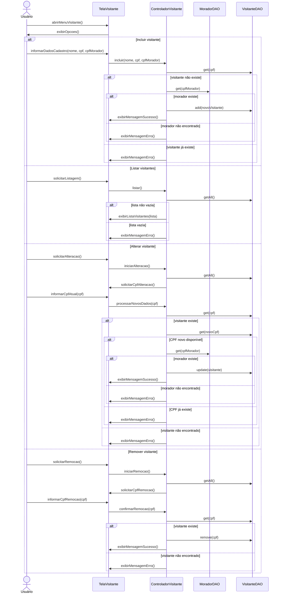

```mermaid
sequenceDiagram
    %% Alterado de participant para actor
    actor Usuário
    participant TelaVisitante
    participant ControladorVisitante
    participant MoradorDAO
    participant VisitanteDAO

    Usuário->>TelaVisitante: abrirMenuVisitante()
    TelaVisitante->>Usuário: exibirOpcoes()

    alt Incluir visitante
        Usuário->>TelaVisitante: informarDadosCadastro(nome, cpf, cpfMorador)
        TelaVisitante->>ControladorVisitante: incluir(nome, cpf, cpfMorador)
        ControladorVisitante->>VisitanteDAO: get(cpf)
        alt visitante não existe
            ControladorVisitante->>MoradorDAO: get(cpfMorador)
            alt morador existe
                ControladorVisitante->>VisitanteDAO: add(novoVisitante)
                ControladorVisitante->>TelaVisitante: exibirMensagemSucesso()
            else morador não encontrado
                ControladorVisitante->>TelaVisitante: exibirMensagemErro()
            end
        else visitante já existe
            ControladorVisitante->>TelaVisitante: exibirMensagemErro()
        end
    else Listar visitantes
        Usuário->>TelaVisitante: solicitarListagem()
        TelaVisitante->>ControladorVisitante: listar()
        ControladorVisitante->>VisitanteDAO: getAll()
        alt lista não vazia
            ControladorVisitante->>TelaVisitante: exibirListaVisitantes(lista)
        else lista vazia
            ControladorVisitante->>TelaVisitante: exibirMensagemErro()
        end
    else Alterar visitante
        Usuário->>TelaVisitante: solicitarAlteracao()
        TelaVisitante->>ControladorVisitante: iniciarAlteracao()
        ControladorVisitante->>VisitanteDAO: getAll()  
        ControladorVisitante->>TelaVisitante: solicitarCpfAlteracao()
        Usuário->>TelaVisitante: informarCpfAtual(cpf)
        TelaVisitante->>ControladorVisitante: processarNovosDados(cpf)
        ControladorVisitante->>VisitanteDAO: get(cpf)
        alt visitante existe
            ControladorVisitante->>VisitanteDAO: get(novoCpf)
            alt CPF novo disponível
                ControladorVisitante->>MoradorDAO: get(cpfMorador)
                alt morador existe
                    ControladorVisitante->>VisitanteDAO: update(visitante)
                    ControladorVisitante->>TelaVisitante: exibirMensagemSucesso()
                else morador não encontrado
                    ControladorVisitante->>TelaVisitante: exibirMensagemErro()
                end
            else CPF já existe
                ControladorVisitante->>TelaVisitante: exibirMensagemErro()
            end
        else visitante não encontrado
            ControladorVisitante->>TelaVisitante: exibirMensagemErro()
        end
    else Remover visitante
        Usuário->>TelaVisitante: solicitarRemocao()
        TelaVisitante->>ControladorVisitante: iniciarRemocao()
        ControladorVisitante->>VisitanteDAO: getAll()
        ControladorVisitante->>TelaVisitante: solicitarCpfRemocao()
        Usuário->>TelaVisitante: informarCpfRemocao(cpf)
        TelaVisitante->>ControladorVisitante: confirmarRemocao(cpf)
        ControladorVisitante->>VisitanteDAO: get(cpf)
        alt visitante existe
            ControladorVisitante->>VisitanteDAO: remove(cpf)
            ControladorVisitante->>TelaVisitante: exibirMensagemSucesso()
        else visitante não encontrado
            ControladorVisitante->>TelaVisitante: exibirMensagemErro()
        end
    end
```
