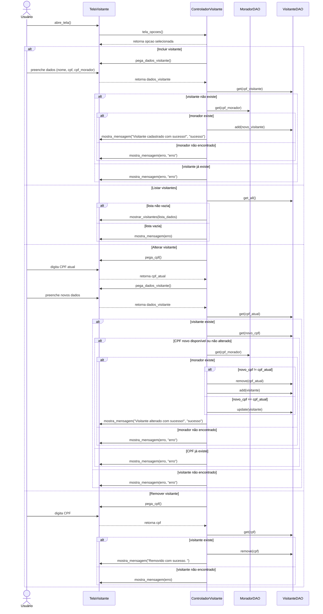

```mermaid
sequenceDiagram
    actor Usuário
    participant TelaVisitante
    participant ControladorVisitante
    participant MoradorDAO
    participant VisitanteDAO

    Usuário->>TelaVisitante: abre_tela()
    TelaVisitante->>ControladorVisitante: tela_opcoes()
    ControladorVisitante-->>TelaVisitante: retorna opcao selecionada

    alt Incluir visitante
        ControladorVisitante->>TelaVisitante: pega_dados_visitante()
        Usuário->>TelaVisitante: preenche dados (nome, cpf, cpf_morador)
        TelaVisitante-->>ControladorVisitante: retorna dados_visitante
        ControladorVisitante->>VisitanteDAO: get(cpf_visitante)
        alt visitante não existe
            ControladorVisitante->>MoradorDAO: get(cpf_morador)
            alt morador existe
                ControladorVisitante->>VisitanteDAO: add(novo_visitante)
                ControladorVisitante->>TelaVisitante: mostra_mensagem("Visitante cadastrado com sucesso!", "sucesso")
            else morador não encontrado
                ControladorVisitante->>TelaVisitante: mostra_mensagem(erro, "erro")
            end
        else visitante já existe
            ControladorVisitante->>TelaVisitante: mostra_mensagem(erro, "erro")
        end

    else Listar visitantes
        ControladorVisitante->>VisitanteDAO: get_all()
        alt lista não vazia
            ControladorVisitante->>TelaVisitante: mostrar_visitantes(lista_dados)
        else lista vazia
            ControladorVisitante->>TelaVisitante: mostra_mensagem(erro)
        end

    else Alterar visitante
        ControladorVisitante->>TelaVisitante: pega_cpf()
        Usuário->>TelaVisitante: digita CPF atual
        TelaVisitante-->>ControladorVisitante: retorna cpf_atual
        ControladorVisitante->>TelaVisitante: pega_dados_visitante()
        Usuário->>TelaVisitante: preenche novos dados
        TelaVisitante-->>ControladorVisitante: retorna dados_visitante
        ControladorVisitante->>VisitanteDAO: get(cpf_atual)
        alt visitante existe
            ControladorVisitante->>VisitanteDAO: get(novo_cpf)
            alt CPF novo disponível ou não alterado
                ControladorVisitante->>MoradorDAO: get(cpf_morador)
                alt morador existe
                    alt novo_cpf != cpf_atual
                        ControladorVisitante->>VisitanteDAO: remove(cpf_atual)
                        ControladorVisitante->>VisitanteDAO: add(visitante)
                    else novo_cpf == cpf_atual
                        ControladorVisitante->>VisitanteDAO: update(visitante)
                    end
                    ControladorVisitante->>TelaVisitante: mostra_mensagem("Visitante alterado com sucesso!", "sucesso")
                else morador não encontrado
                    ControladorVisitante->>TelaVisitante: mostra_mensagem(erro, "erro")
                end
            else CPF já existe
                ControladorVisitante->>TelaVisitante: mostra_mensagem(erro, "erro")
            end
        else visitante não encontrado
            ControladorVisitante->>TelaVisitante: mostra_mensagem(erro, "erro")
        end

    else Remover visitante
        ControladorVisitante->>TelaVisitante: pega_cpf()
        Usuário->>TelaVisitante: digita CPF
        TelaVisitante-->>ControladorVisitante: retorna cpf
        ControladorVisitante->>VisitanteDAO: get(cpf)
        alt visitante existe
            ControladorVisitante->>VisitanteDAO: remove(cpf)
            ControladorVisitante->>TelaVisitante: mostra_mensagem("Removido com sucesso. ")
        else visitante não encontrado
            ControladorVisitante->>TelaVisitante: mostra_mensagem(erro)
        end
    end
```
