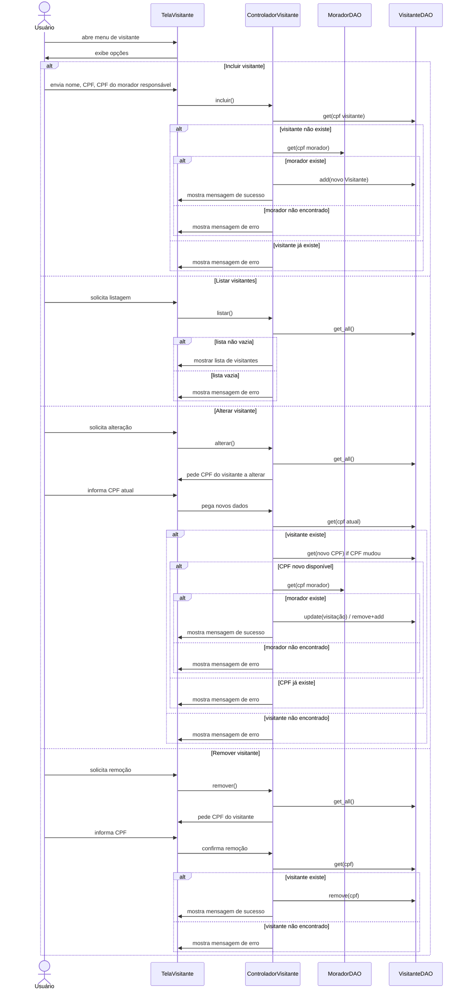

```mermaid

sequenceDiagram

    actor Usuário

    participant TelaVisitante

    participant ControladorVisitante

    participant MoradorDAO

    participant VisitanteDAO


    Usuário->>TelaVisitante: abre menu de visitante

    TelaVisitante->>Usuário: exibe opções


    alt Incluir visitante

        Usuário->>TelaVisitante: envia nome, CPF, CPF do morador responsável

        TelaVisitante->>ControladorVisitante: incluir()

        ControladorVisitante->>VisitanteDAO: get(cpf visitante)

        alt visitante não existe

            ControladorVisitante->>MoradorDAO: get(cpf morador)

            alt morador existe

                ControladorVisitante->>VisitanteDAO: add(novo Visitante)

                ControladorVisitante->>TelaVisitante: mostra mensagem de sucesso

            else morador não encontrado

                ControladorVisitante->>TelaVisitante: mostra mensagem de erro

            end

        else visitante já existe

            ControladorVisitante->>TelaVisitante: mostra mensagem de erro

        end

    else Listar visitantes

        Usuário->>TelaVisitante: solicita listagem

        TelaVisitante->>ControladorVisitante: listar()

        ControladorVisitante->>VisitanteDAO: get_all()

        alt lista não vazia

            ControladorVisitante->>TelaVisitante: mostrar lista de visitantes

        else lista vazia

            ControladorVisitante->>TelaVisitante: mostra mensagem de erro

        end

    else Alterar visitante

        Usuário->>TelaVisitante: solicita alteração

        TelaVisitante->>ControladorVisitante: alterar()

        ControladorVisitante->>VisitanteDAO: get_all()  

        ControladorVisitante->>TelaVisitante: pede CPF do visitante a alterar

        Usuário->>TelaVisitante: informa CPF atual

        TelaVisitante->>ControladorVisitante: pega novos dados

        ControladorVisitante->>VisitanteDAO: get(cpf atual)

        alt visitante existe

            ControladorVisitante->>VisitanteDAO: get(novo CPF) if CPF mudou

            alt CPF novo disponível

                ControladorVisitante->>MoradorDAO: get(cpf morador)

                alt morador existe

                    ControladorVisitante->>VisitanteDAO: update(visitação) / remove+add

                    ControladorVisitante->>TelaVisitante: mostra mensagem de sucesso

                else morador não encontrado

                    ControladorVisitante->>TelaVisitante: mostra mensagem de erro

                end

            else CPF já existe

                ControladorVisitante->>TelaVisitante: mostra mensagem de erro

            end

        else visitante não encontrado

            ControladorVisitante->>TelaVisitante: mostra mensagem de erro

        end

    else Remover visitante

        Usuário->>TelaVisitante: solicita remoção

        TelaVisitante->>ControladorVisitante: remover()

        ControladorVisitante->>VisitanteDAO: get_all()

        ControladorVisitante->>TelaVisitante: pede CPF do visitante

        Usuário->>TelaVisitante: informa CPF

        TelaVisitante->>ControladorVisitante: confirma remoção

        ControladorVisitante->>VisitanteDAO: get(cpf)

        alt visitante existe

            ControladorVisitante->>VisitanteDAO: remove(cpf)

            ControladorVisitante->>TelaVisitante: mostra mensagem de sucesso

        else visitante não encontrado

            ControladorVisitante->>TelaVisitante: mostra mensagem de erro

        end

    end

``` 

